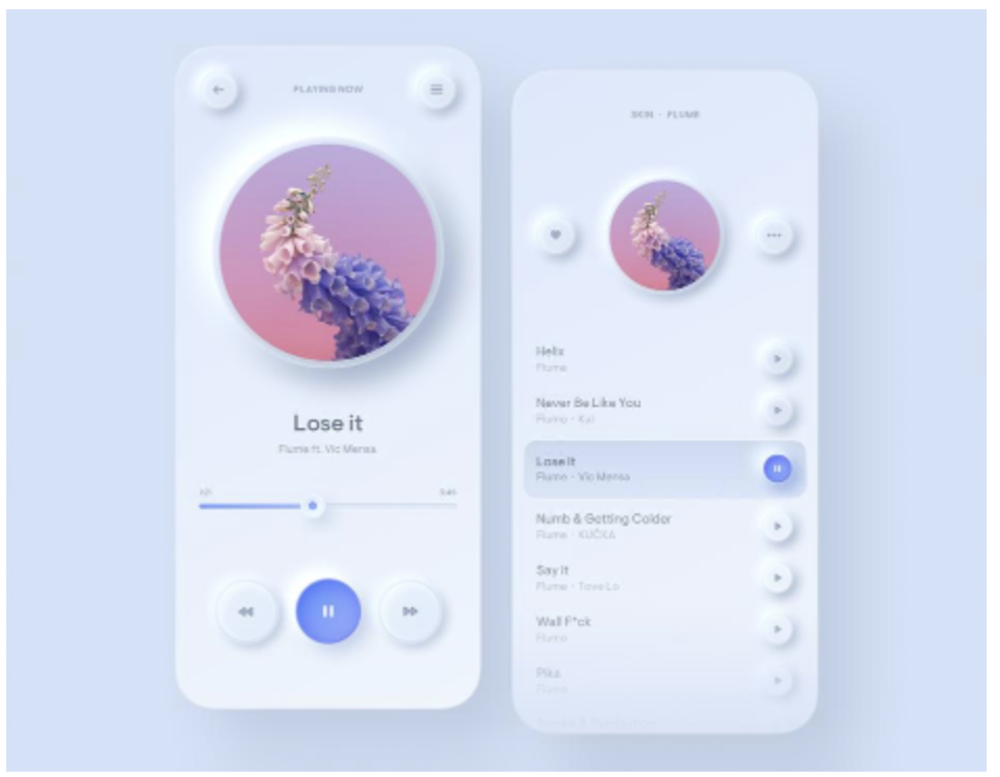

요즘  개발이나 ppt를 만들면 뉴모피즘을 활용하는 것이 하나의 트렌드로 자리잡고 있는 것 같다

뉴모피즘의 핵심은 그냥 경계선을 사용하지 않은 디자인의 나열이 아니다. 예시를 통해 이것이 어떤 의미인지 알아보자.

.png)

이 사진에 나온 아이콘 내지 컴포넌트들이 예쁘다고 할 수 있는가?

나는 아니라고 생각한다. 물론 어떤 결과물인 것은 아니기에 평가하는 것이 의미없다고 생각하긴 하지만 단순한 뉴모피즘 디자인의 나열이 언제나 시각적 만족을 준다는 이야기는 아니다.

위 사진 중 첫번쨰는 아까 말한 것과 같은 뉴모피즘 만으로 이루어진 앱이다. 감각적이고 몽환적이게 느껴질 수 있으나 이를 실사용하는입장에서 보면 조작의 직관성을 해치고 정보 부분과 입력 또는 인터랙팅 부분에 대한 구분이 어렵다.

이는 뉴모피즘의  장점이자 단점인 "비강조"에 있다. 뉴모피즘은 그것이 사용된 요소를 강조하지 않는다, 그저 배경과 약간다른, 사용자가 눈길을 한번 줄만한 정도의 차별점만 둠으로써 사용자의 시선 흐름을 방해하지 않되, 사용자가 그 기능을 요구한다면 충분히 찾아낼 수 있을 정도이다. 첫번째 예시는 모든 인터렉션 심지어 꽤나 중요한 정보에까지 뉴모피즘을 사용하였다. 이렇게되면 사용자의 기준에서 정보부터 인터렉션까지 모두 "동등한 레벨"의 중요성을 가진다고 판단하는데 일조한다. 결국 사용자는 필요한 기능을 찾는데 오래걸리고 앱의 사용에 있어 피로를 느끼게 된다.

반면 두번쨰 예시를 보자 메인화면에서 뉴모피즘 디자인을 사용하는 것은 검색창, 또한 꽤나 찾기 어려운 하단 메뉴바 2가지가 있다. 먼저 각각을 개발자가 어떤 의도르 만들었는지 보자. 검색창은 해당 앱의 도서를 검색하는데 있어 필수적이다. 다만, 책을 한번 찾고 나면 사용자는 읽던 책에 집중하는 경향이 있다. 그렇다면 검색창은 굳이 필요하지 않은 것이 될것이다. 그럼에도 사용자가 다른 책을 읽고 싶은 경우를 위해 언제나 같은 자리에 있어야만한다.(같은자리에 있을 필요가 없다는 것도 좋은 접근이지만, 그건 다음에 기회가 된다면 이야기 해보자. 사용자는 언제나 익숙한 것을 좋아한다) 그런 관점에 있어 검색창에 뉴모피즘을 사용한것은 적절하다. 배경과 차볋화 되어 있어 그 자리에 검책창이 있음을 알면서도 내가 읽던 책을 읽는데 있어 방해를 하지 않는다. 조금만 더 깊게 들어가보면 검색창은 배경보다 한차원 들어간 형태의 뉴모피즘 디자인을 하고 있다. 튀어나온 것이 아니라 들어간 것, -1차원은 우리에게 구분감을 주면서도 중요하지 않다는 암시를 준다. 두번쨰는 메뉴바이다. 그리고 여기서는 개발자의 의도가 한층 더 명확하다. 바로 "다른 기능의 지원"이다. 이 앱은 크게 책의 정보와 메뉴로 나뉜다. 이를 구분하기 위한 목적으로 뉴모피즘을 사용했으며, 굳이 찾자면 검색창과의 디자인 통일성을 위해 사용했을 것이라 생각하는 정도이다.

뉴모피즘은 강조되지 않아도 그 기능을 충분히 이해할 수 있는 부분에 사용함으로써 사용자가 자연스럽게 기능을 알 되, 이를 지나치게 배경 또는 주변 컴포넌트와 구분 짓지 않는 것이 가장  적절한 사용방안이라 생각된다.

나는 디자인을 하면서 언제나 "차원"을 생각한다. 사용자가 보는 차원, 앱을 옆에서 보면 보이는 차원, css의 z-layer...
이러한 차원의 관점에서 선이나 색 통한 구분은 1차원이며, 이러한 양자화된 차원에 뉴모피즘은 0~1의 가변적인 차원을 제공하는 효과적인 수단이다. 얼마나 그림자를 즐것이냐, 넣을 것이냐 튀어나오게 할것이냐에 따라 사용자가 이 요소를 얼마나 유심히 봐야하는지가 드러난다.

글을 마치며 뉴모피즘 디자인을 하는데 있어 많이 쓰일 것 같은 사이트를 하나 소개한다.

https://neumorphism.io/#985757

색은 순전히 내 취향이다. 다음 글은 아마 figma와 react에 대한 것일 것 같다.