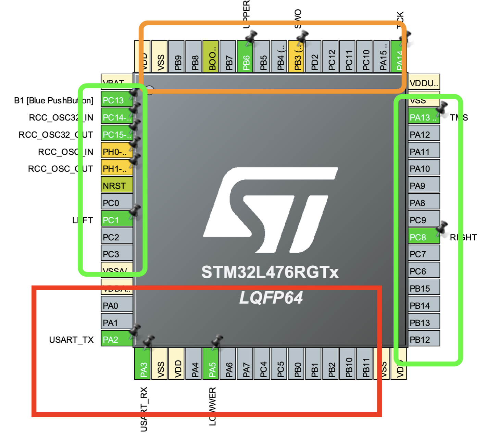
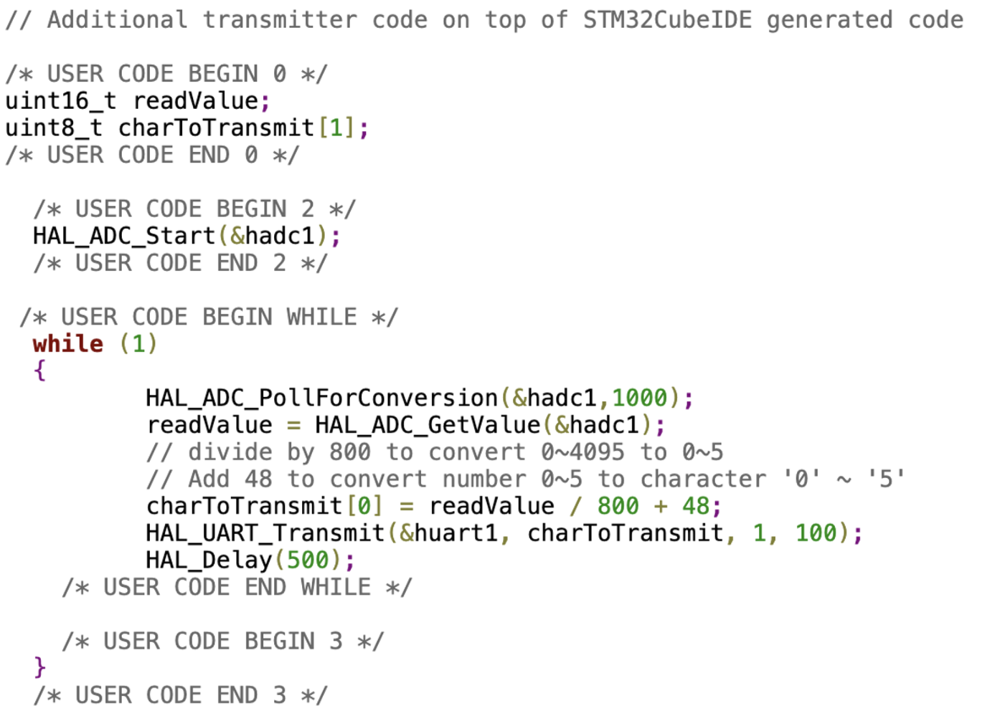
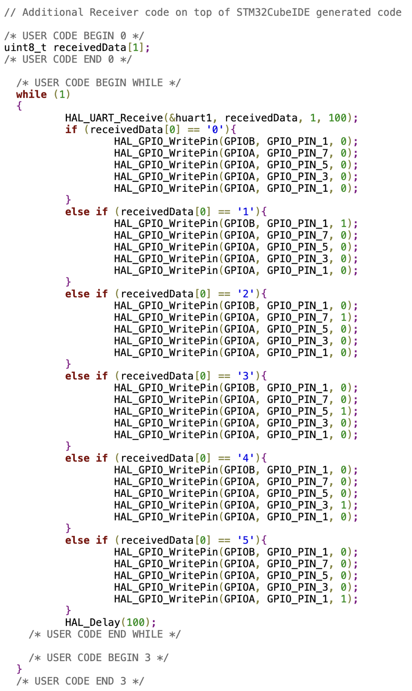
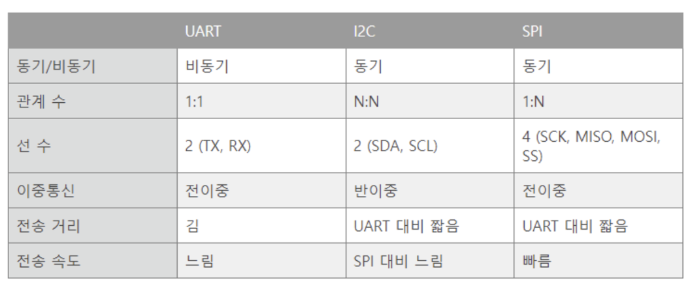

내일까지 개발해야되서 노션에 정리한거 대신 올립니당 ㅠㅠ
## 기본 구조의 이해

STM32-L476RGTx LQFP64는 3개의 포트를 사용할 수 있음.

(더 많은 핀을 가진 경우에는 최대 A~G까지 포트를 사용할 수 있는 것 같음)



이 칩에서 사용하는 핀에 대한 포트는

빨간색이 A

주황색이 B

초록색이 C

인 것 같다.(구분이 명확하지는 않은듯..?)

→

https://www.youtube.com/watch?app=desktop&v=IEfoatO4Pc4 코드에서 보면

```c
/* 수신부에서 lED를 켜는 코드(아마?) */
HAL_GPIO_WritePin(GPIOB, GPIO_PIN_1,0)
...
HAL_GPIO_WritePin(GPIOA, GPIO_PIN_1,0)
```

과 같이 GPIO_PIN의 이름이 겹치는 경우가 있는데 이 경우 다른 포트의 핀을 사용한 것이기에 사실상 다른 핀이라고 이해하면 될 것 같다.

| GPIOA | GPIO_PIN_1  |
| ----- | ----------- |
|       | …           |
|       | GPIO_PIN_15 |
| GPIOB | GPIO_PIN_1  |
|       | …           |
|       | GPIO_PIN_15 |

와 같은 구조라고 이해하면 될 듯하다.

## https://www.youtube.com/watch?app=desktop&v=IEfoatO4Pc4 에서의 코드 설명

(https://www.micropeta.com/video2에 주요 코드 일부가 있음)

### 송신부



```c
uint16_t readValue;
uint8_t charToTransmit[1];
...
	HAL_ADC_Start(&hadc1)
	
	while(1){
		HAL_ADC_PollForConversion(&hadc1,1000);
		readValue = HAL_ADC_GetValue(&hadc1);
		charToTransmit[0] = readValue/800 + 48;
		HAL_UART_Transmit(&huart1, charToTransmit, 1, 100);
		HAL_Delay(500);
	}
```

<aside> 💡 먼저, HAL이란 라이브러리의 일종으로 Standard Ferif 라이브러리 대신 사용할 수 있는 라이브러리인 것으로 보인다. (cpp의 io 같은 느낌..?)

</aside>

<aside> 💡 hadc1은 개발자가 앞에서 정의한 ADC핸들의 이름이다.

</aside>

```
uint16_t readValue; uint8_t charToTransmit[1];
```

적절한 형태의 변수를 정의해주는 부분이다.

readValue는 가변저항의 값을

charToTransmit의 경우에는 전송할 값(숫자의 문자형태)를 저장하는 변수이다.

```
HAL_ADC_PollForConversion(&hadc1,1000);
```

ADC(아날로그 신호를 디지털로 변환하는 장치)가 준비됐는지 확인하는 부분

```
readValue = HAL_ADC_GetValue(&hadc1);
```

가변저항 값 읽기

```
charToTransmit[0] = readValue/800 + 48;
```

단순연산으로 가변저항값(0~4095) → 숫자(자료형은 문자, ‘0’,’1’,’2’…)로 변환

<aside> 💡 UART는 병렬데이터를 직렬화해 통신하는 개별 직접회로를 의미한다.

</aside>

```
HAL_UART_Transmit(&huart1, charToTransmit, 1, 100);
```

charToTransmit을 터미널로 출력한다.(이 코드에서는 loRa로 데이터를 전송하는 코드인 거 같다.-정확하지는 않음.)

## 수신부



위에서 설명한 코드는 생략하고 설명함

```
HAL_UART_Receive(&huart, receivedData, 1, 100);
```

loRa통신으로 수신받은 값을 receivedData에 저장한다.

# LoRA

## LoRA란

저전력 통신변조 기술로 통신규격(4G,5G 등)의 일종

장거리 저전력 통신이 가능

## 통신 프로토콜이란

통신 규약이라고도 하며, 메세지를 주고 받는 양식과 규칙이다.

위 코드에서 사용한 통신 프로토콜은 UART으로, 데이터 전송 혹은 수신핀이 하나인 코드이다.



이 표는 일반적으로 사용되는 통신 프로토콜의 종류이다.

위 코드에서 UART를 사용하는 목적은 stm32 마이크로 프로세서에서 LoRA모듈에 전송할 데이터를 전달하는데 사용된다. 즉 LoRA통신에 있어 UART가 사용되는 것이 아닌, 마이트로 프로세서와 LoRA모듈 간의 통신에서 UART가 사용되는 것이라고 생각하면 될 것 같다.

(그러면 LoRa모듈 내부에는 이 정보를 다시 전달하는 코드가 있나?)