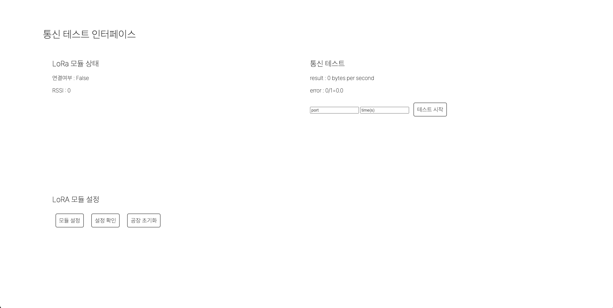
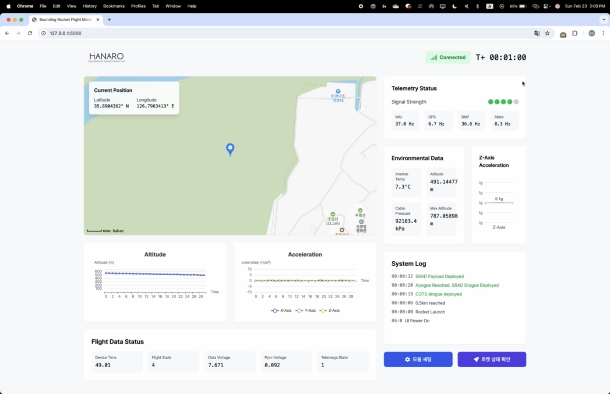

어제(2월 23일) KHAOS 1차 발사에 성공했다.
10월 이후로는 학업과 병행하였기에, 주요 시스템 개발보다는 통신테스트에 대한 검증과 동체등과 같이 사출 테스트 등을 진행하는 것을 위주로 활동하였다.
이와 관련되어 통신테스트, 발사 중 UI를 flask를 기반으로한 웹 프레임워크로 프로그래밍 하여 사용하였다. 아래는 각각의 사진이다.

로켓의 최고고도는 현재 1980m정도로 추정되고 있으며, 정확한 고도는 데이터 처리가 마무리 된 뒤에 알 수 있을 것으로 보인다.
이번 발사를 통해 알게된 점이 있는데, 가장 중요한 것은 발사 상황에서 UI에 무엇이 표기되어 있고, 나는 무엇을 확인하고 전체 무전을 해야하는가에 대한 것이다. 지금 UI에는 지도가 가장 큰 비중을 차지하고 있으나 실제 발사에서 보야하는 중요한 것으로는 에비오닉스가 사출신호를 보냈는가 (가속도 등으로) 전개충격이 감지되었는가이다. 이번발사에서는 사출신호를 보낸것은 무전을 하였지만 가속도 그래프가 있었음에도 전개충격이 감지되었다는 것을 바로 전달하지 못하였다. 이를 바탕으로 UI에 무엇을 띄우고, 우선순위로 둘 것인가를 고려하여 새로 디자인해야할 것 같다. 먼저 사출신호 전달여부와, 전개충격 확인을 위한 가속도계가 우선되어야하며, 고도와 최고고도를 파악할 수 있도록 이를 표시하고, 드로그와 메인 낙하산이 펴졌음을 확인할 수 있도록 고도 그래프를 그려 그 낙하속도가 종단속도에 도달하였는지 확인하여야할 것으로 보인다. 그 외에 기존에 표기됐던 온도나 STATE에 해당하는 부분은 하단 또는 측면으로 옮길 예정이다. 마지막으로 IREC에서는 데이터 통신이 원활하지 않아 지도 표기가 어려울 수 있다. 이를 고려해 지도를 없애고 GPS위치를 바로 공유(구글 지도 등으로)할 수 있는 링크를 생성하는 것을 고려하고 있다.
사출신호, 전개충격을 어떻게 표기할지는 조금 더 고려해보아야한다. 각 단계에 색깔이 바뀌는 식으로 할 수도, 기존처럼 SYSTEM LOG가 표기되게 할수도 있어서 가독성이 좋도록 해야할 것 같다.

마지막으로 통신을 받기 전 UI가 켜져있으면 통신을 받고도 작동하지 않던 문제(TRY EXCPET구문 떄문이라 추정) 또한 해결되어야한다.

다음 KHAOS발사는 4월 말로 예정되어 있다. 그 전까지 무지향성 안테나에 대한 장거리(5KM이상) 통신테스트를 포함하여 UI 수정등의 활동을 진행하게 될 것 같다.